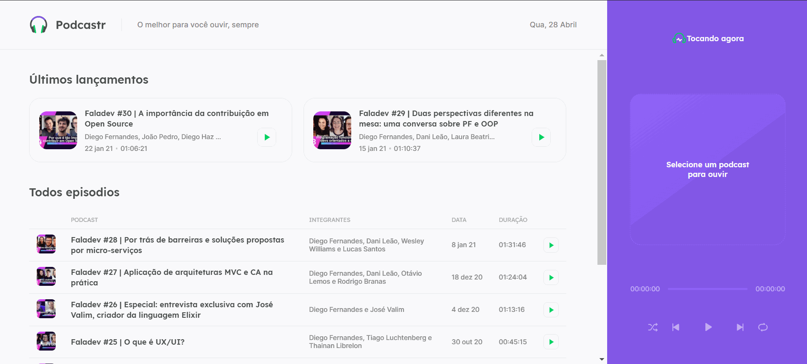

  

# Podcastr NLW 
### - Projeto criado juntamente com a Rocketseat na semana NLW trilha React JS.

<<<<<<< HEAD
### - Nesta semana pude aprender bastante sobre React JS juntamente com o Next.JS e pude entender o poder que o Next pode dar a sua aplicação com as criações de páginas dinâmicas e estáticas (SPA, SSR e SSG)
=======
### - Nesta semana pude aprender bastante sobre React JS juntamente com o Next.JS e entender o poder que o Next pode dar a sua aplicação com as criações de páginas dinâmicas e estáticas (SPA, SSR e SSG)
>>>>>>> 6ee24b3c9d5a6fee7352c71348fa9ca3684c8090

### - Nesta aplicação foram usadas as seguintes tecnologias:

- [ReactJS](https://reactjs.org/)
- [Typescript](https://www.typescriptlang.org/)
- [Next.js](https://nextjs.org/)
- [Sass](https://sass-lang.com/)
- [API](https://github.com/andrealvesz/PodcastrNext)
- 

### Repositório: https://github.com/lucasmetron/NLW-Podcastr

### Gostou do meu projeto? :D Entre em contato comigo! 
[Linkedin](https://www.linkedin.com/in/lucas-rosa-058683102/)  
[Email: lucasmetron@gmail.com](mailto:lucasmetron@gmail.com)
[Email: lucasmetron@gmail.com](mailto:lucasmetron@gmail.com)

